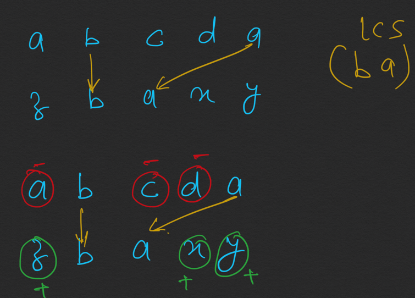
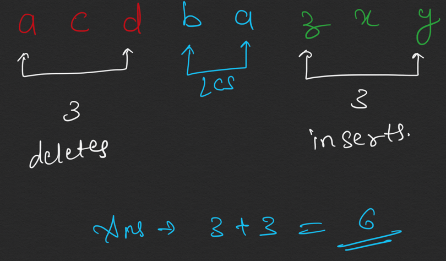

```java
//583. Delete Operation for Two Strings
//https://leetcode.com/problems/delete-operation-for-two-strings/
class DeleteOperationforTwoStrings583 {
    int[][] dp;

    public int minDistance(String word1, String word2) {

        if (word1 == null || word2 == null) return 0;

        dp = new int[word1.length() + 1][word2.length() + 1];
        for(int[] arr : dp){
            Arrays.fill(arr, -1);;
        }

        int common = lcs(word1, word2, word1.length(), word2.length());
        return (word1.length() - common) + (word2.length() - common); //remove non common from w1 + append non common from w2
                                                                        // ab ac, a is common  remove b + add c == 2 operations
    }

//if no letter matches delete word1 length and add word2 length 
//check if dp has, else calculate, add in dp, return dp
    private int lcs(String s1, String s2, int m, int n) {

        if (m == 0 || n == 0) return 0;
        if (dp[m][n] != -1) return dp[m][n];

        int ans;
        if (s1.charAt(m - 1) == s2.charAt(n - 1)) {
            ans = 1 + lcs(s1, s2, m - 1, n - 1);
        } else {
            ans = Math.max(lcs(s1, s2, m, n - 1), lcs(s1, s2, m - 1, n));
        }
        dp[m][n] = ans;
        return dp[m][n];
    }

}
```


