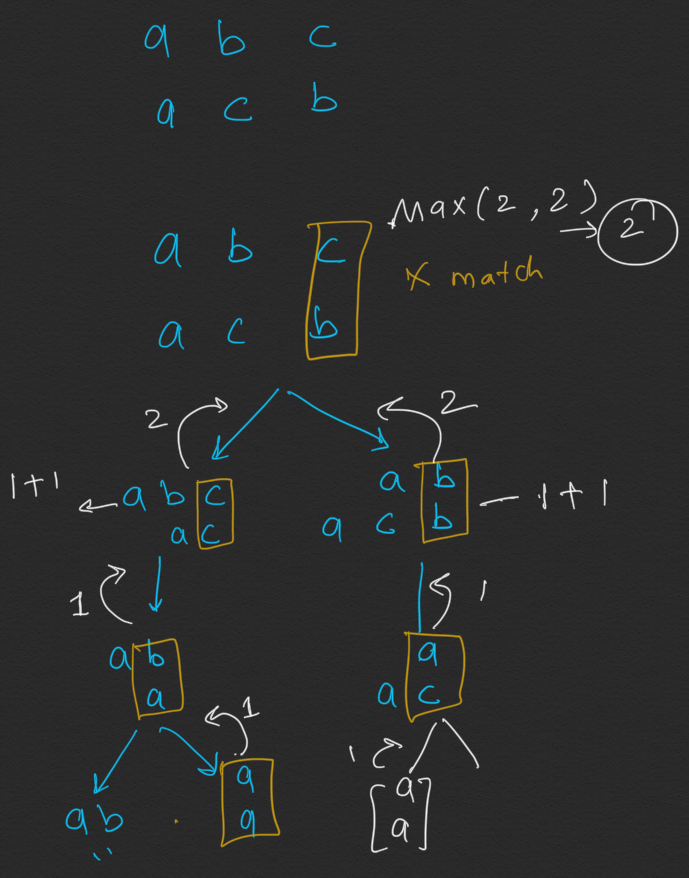

```java
//1143. Longest Common Subsequence
//https://leetcode.com/problems/longest-common-subsequence/

import java.util.Arrays;
import java.util.stream.Stream;

class LongestCommonSubsequence1143 {

    int[][] dp;

    public int longestCommonSubsequence(String text1, String text2) {
        if (text1 == null || text2 == null) return 0;
        dp = new int[text1.length() + 1][text2.length() + 1];

        for(int[] arr : dp){
            Arrays.fill(arr, -1);
        }

        return lcs(text1, text2, text1.length(), text2.length());
    }

    private int lcs(String s1, String s2, int m, int n) {//ab
                                                           //ba
        if (m == 0 || n == 0) return 0;

        if (dp[m][n] != -1) return dp[m][n];

        int ans ;

        if (s1.charAt(m - 1) == s2.charAt(n - 1)) {
            ans = 1 + lcs(s1, s2, m - 1, n - 1);
        } else {
            ans = Math.max(lcs(s1, s2, m, n - 1), lcs(s1, s2, m - 1, n));
        }
        dp[m][n] = ans;
        return dp[m][n];

    }

}
//         "" a b
//    ""
//    a
//    b         ans
`````
