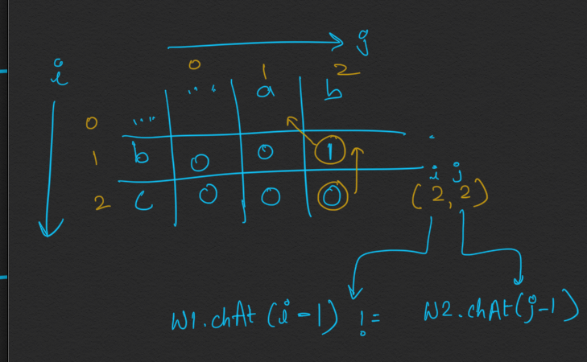
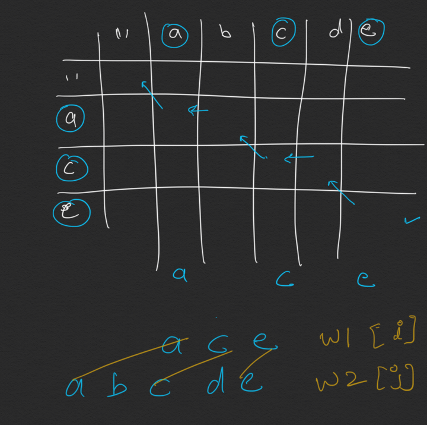

```java
class PrintLCS {
    int[][] dp;

    public String print(String w1, String w2) {
        if (w1 == null || w2 == null) return "";

        dp = new int[w1.length() + 1][w2.length() + 1];

        for (int[] arr : dp) {
            Arrays.fill(arr, -1);
        }

        lcs(w1, w2, w1.length(), w2.length());
        return printSeq(w1, w2);
    }

    private String printSeq(String w1, String w2) {
        int i = dp.length - 1;
        int j = dp[0].length - 1;
        StringBuilder sb = new StringBuilder();

        while (i > 0 && j > 0) {
            if (w1.charAt(i - 1) == w2.charAt(j - 1)) {
                sb.append(w1.charAt(i-1));//diagonal
                i--;
                j--;
            } else if (dp[i][j - 1] >= dp[i - 1][j]) {//left
                j--;
            } else i--;//up
        }
        return sb.reverse().toString();
    }

    private int lcs(String s1, String s2, int m, int n) {

        if (m == 0 || n == 0) return 0;
        if (dp[m][n] != -1) return dp[m][n];

        int ans;
        if (s1.charAt(m - 1) == s2.charAt(n - 1)) {
            ans = 1 + lcs(s1, s2, m - 1, n - 1);
        } else {
            ans = Math.max(lcs(s1, s2, m, n - 1), lcs(s1, s2, m - 1, n));
        }
        dp[m][n] = ans;
        return dp[m][n];
    }
}
```


