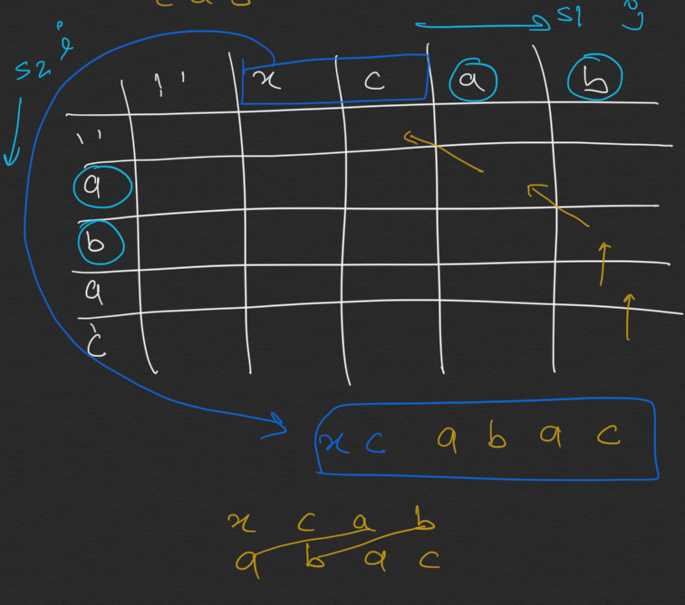

```java
//1092. Shortest Common Supersequence
//https://leetcode.com/problems/shortest-common-supersequence/
class ShortestCommonSupersequence1092 {
    int[][] dp;

    public String shortestCommonSupersequence(String str1, String str2) {

        if (str1 == null || str2 == null) return "";
        int m = str1.length();
        int n = str2.length();

        dp = new int[m + 1][n + 1];  //catch
        for (int[] arr : dp) {
            Arrays.fill(arr, -1);
        }

        lcs(str1, str2, m, n);
        return getSuperSequence(str1, str2);

    }

    private int lcs(String s1, String s2, int m, int n) { //help us drive. Towards common. Character

        if (m == 0 || n == 0) return 0;
        if (dp[m][n] != -1) return dp[m][n];

        int ans;
        if (s1.charAt(m - 1) == s2.charAt(n - 1)) {
            ans = 1 + lcs(s1, s2, m - 1, n - 1);

        } else {
            ans = Math.max(lcs(s1, s2, m, n - 1), lcs(s1, s2, m - 1, n));
        }
        dp[m][n] = ans;
        return dp[m][n];
    }

    private String getSuperSequence(String s1, String s2) {
        int i = dp.length - 1;
        int j = dp[0].length - 1;

        StringBuilder sb = new StringBuilder();

        while (i > 0 && j > 0) {
            if (s1.charAt(i - 1) == s2.charAt(j - 1)) { //catch
                sb.append(s1.charAt(i - 1));  //diagonal
                i--;
                j--;
            } else if (dp[i][j - 1] >= dp[i - 1][j]) { //dp helps move towards common character
                sb.append(s2.charAt(j - 1)); //left
                j--;
            } else {
                sb.append(s1.charAt(i - 1)); //up
                i--;
            }
        }
        while (i > 0) {
            sb.append(s1.charAt(i - 1));i--; //catch s1  will  take i -1 as index  and not i
        }
        while (j > 0) {
            sb.append(s2.charAt(j -1)); j--;
        }
        return sb.reverse().toString();
    }
}
```



